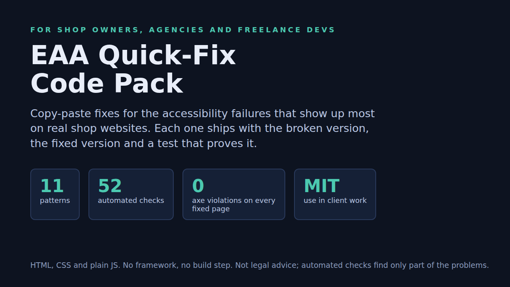
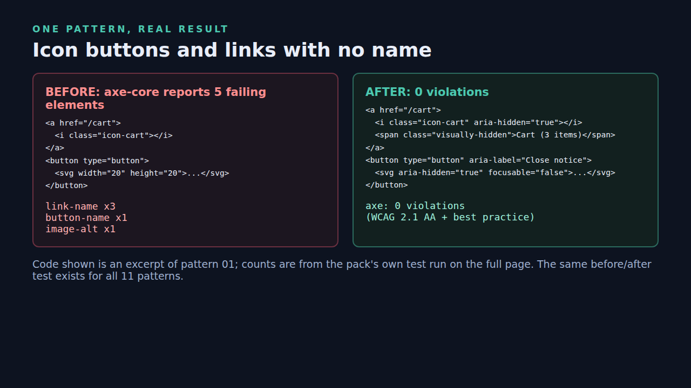

# EAA Quick-Fix Code Pack (free lite)



Copy-paste fixes for the accessibility failures that show up most on real shop websites. This free lite version has the colour-contrast tool and palette plus three of the eleven patterns. The full pack (11 patterns, 4 scripts, 52 automated checks) is here: **https://croucamp.gumroad.com/l/eaa-quickfix-code-pack** (9, MIT, 30-day refund).

In our automated scan of 39 EU shop home pages, 87% had at least one failure and low contrast was on 46% of them ([study](https://hanru269.github.io/eaa-scan/study.html): home pages only, automated checks only, large brands rather than small shops).

## What is in this repo

| Path | What it does |
|---|---|
| `tools/contrast-check.js` | Zero-dependency WCAG contrast calculator. Tells you the ratio and the nearest passing colour, and checks every pair in a tokens file (exit code 1 on failure, so it works in CI). |
| `css/tokens.css` | A light + dark palette where every listed pair passes WCAG 2.1 AA. |
| `css/a11y-base.css` | Skip link, two-colour focus ring, visually-hidden text, target size, reduced motion. |
| `patterns/01-icon-buttons-links` | Icon-only links and buttons with no accessible name (axe: `link-name`, `button-name`, `image-alt`). |
| `patterns/05-skip-link-landmarks` | Page title, language, landmarks, one h1, a skip link that works. |
| `patterns/10-contrast` | Pale text and white-on-orange buttons, fixed with the palette. |

Each pattern folder has `before.html` (fails) and `after.html` (passes). Open them in a browser or scan them with axe.

## Try the contrast tool

```
$ node tools/contrast-check.js "#999999" "#ffffff"
$ node tools/contrast-check.js "#ffffff" "#f5a623"
$ node tools/contrast-check.js --css css/tokens.css
```

Real output:

```
2.85:1  FAIL (needs 4.5:1)
nearest passing foreground: #767676
2.03:1  FAIL (needs 4.5:1)
nearest passing foreground: #474747
PASS  [dark] --danger #ff8a80 on --bg #10151f  8.01:1 (needs 4.5)
PASS  [dark] --border #8a94aa on --bg #10151f  6.00:1 (needs 3)
PASS  [dark] --focus #7db4ff on --bg #10151f  8.57:1 (needs 3)
all 18 pairs pass
```



## What the full pack adds

Form labels and error summaries, images and alt text, lists and navigation, a visible focus ring, an accessible modal dialog, tabs, a keyboard-safe dropdown, zoom/reflow/reduced motion, four plain-JS helpers, a one-page guide, and `npm test`: 52 checks with axe-core and real keyboard tests in Chromium. Every fixed page has zero axe violations.

## Limits

Not legal advice and not a compliance certificate. Automated tools find only part of the problems; test with a keyboard and a screen reader. The keyboard behaviour in the full pack was tested in Chromium only. MIT licence.
